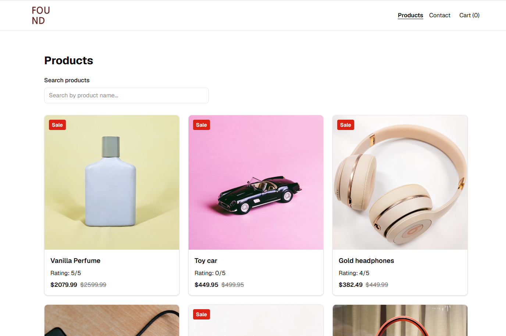

# Found

A responsive online shop built with React and TypeScript.


Found was developed as a JavaScript Frameworks course assignment. The application retrieves products from the Noroff Online Shop API and allows users to search for products, view product details, manage a persistent shopping cart, complete a checkout flow, and submit a validated contact form.

## Description

- A user may browse products retrieved from the `/online-shop` endpoint.
- A user may search for products by title and select a result to open its product page.
- A user may view a product’s image, description, price, discount, rating, tags, and reviews.
- A user may add products to the shopping cart.
- A user may increase or decrease product quantities.
- A user may remove products from the shopping cart.
- A user may view the total number of items and the total cart price.
- A user may complete the checkout flow and receive a confirmation message.
- A user may submit a contact form with validated input.

## Features

- Responsive layout for desktop, tablet, and mobile.
- Dynamic client-side product search.
- Product detail pages using dynamic routes.
- Conditional discount prices and sale badges.
- Toast notifications when products are added or removed.
- Persistent shopping cart using Zustand and local storage.
- Adjustable quantities and derived cart totals.
- Checkout success page that clears the cart.
- Contact form with on-blur validation and clear error messages.
- Loading, empty, not-found, and API error states.
- Light and dark theme support.

## Tech Stack & Tools

- **React** – Component-based user interface library.
- **TypeScript** – Static typing and compile-time type safety.
- **Vite** – Development server and production build tool.
- **React Router** – Client-side routing and dynamic product routes.
- **Zustand** – Global and persistent shopping-cart state.
- **React Hook Form** – Contact-form state and submission handling.
- **Zod** – Runtime schema validation for contact-form input.
- **Tailwind CSS** – Utility-first styling and responsive design.
- **shadcn/ui and Base UI** – Reusable interface components.
- **Sonner** – Toast notifications.
- **next-themes** – Light and dark theme handling.
- **Lucide React** – Interface icons.
- **ESLint** – Static code analysis and code-quality checks.

## API

Product data is retrieved from the Noroff Online Shop API:

```text
https://v2.api.noroff.dev/online-shop
```

The application uses:

```text
GET /online-shop
GET /online-shop/<id>
```

The complete product list is fetched once and stored in local component state. Search results are derived client-side by filtering the stored product array as the user types.

The project does not require environment variables or API keys.

## Setup

Clone the repository:

```bash
git clone https://github.com/NoroffFEU/jsfw-2025-v1-annika-js-frameworks-ca.git
```

Move into the project directory:

```bash
cd jsfw-2025-v1-annika-js-frameworks-ca
```

Install the dependencies:

```bash
npm install
```

Start the development server:

```bash
npm run dev
```

## Usage

Create a production build:

```bash
npm run build
```

Preview the production build locally:

```bash
npm run preview
```

Run ESLint:

```bash
npm run lint
```

## Contact Form

The contact form uses React Hook Form and Zod for client-side validation. Zod validates user input at runtime, while TypeScript provides compile-time type safety.

The form is not connected to a server endpoint. Successful submissions provide user feedback and reset the form, but no message is transmitted or stored externally.

## Live Site

https://found-found.netlify.app/

## Repository and Contact

The project repository is available on [GitHub](https://github.com/NoroffFEU/jsfw-2025-v1-annika-js-frameworks-ca).

Feedback may be submitted through the repository’s issue tracker.

[LinkedIn](https://www.linkedin.com/in/annika-eld%C3%B8y-6ba352198/)

## AI Usage

Artificial intelligence was used for planning, conceptual explanations, debugging, code review, and documentation support. All AI assistance is documented in [AI_LOG.md](./AI_LOG.md).
